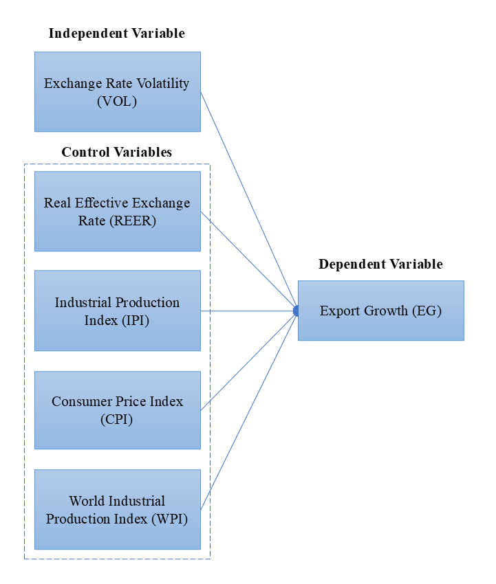
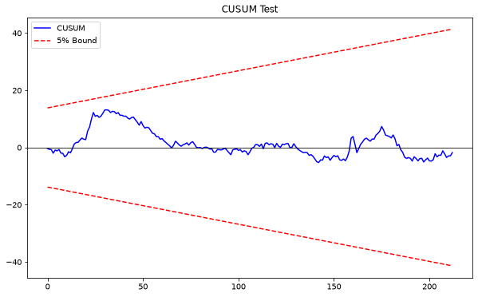
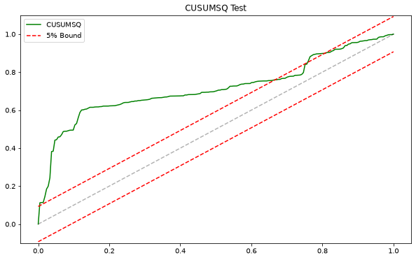
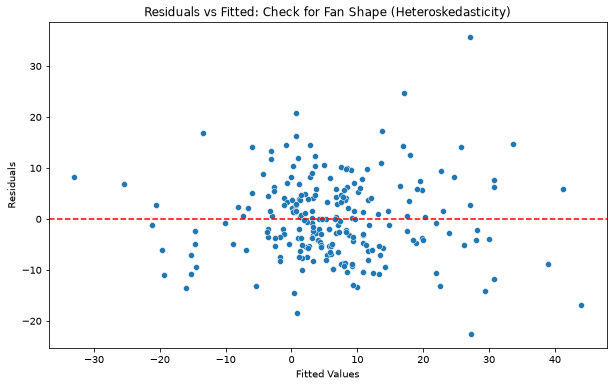
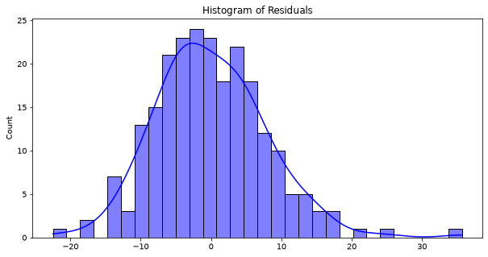
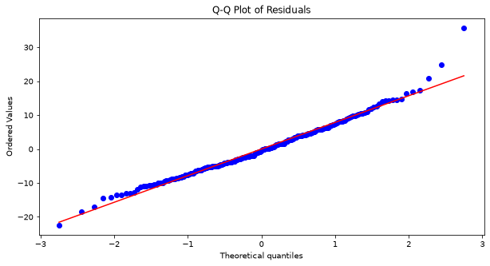

# Exchange Rate Volatility and Export Growth in Malaysia

**Python | Financial Econometrics | ARIMA | EGARCH | ARDL | ECM | Time-Series Analysis**

## Project Overview

This project investigates the impact of **MYR/USD exchange-rate volatility on Malaysia's export growth** using Python-based financial econometric modelling.

The study applies a two-stage quantitative framework:

1. Estimate MYR/USD exchange-rate volatility using ARIMA and GARCH-family models.
2. Incorporate the estimated volatility into an ARDL framework to analyse its short-run and long-run relationship with Malaysia's export growth.

The study covers **January 2006 to September 2025**, capturing multiple periods of financial and macroeconomic uncertainty.

---

## Research Objectives

The project aims to:

- Estimate the conditional volatility of the MYR/USD exchange rate.
- Examine whether exchange-rate volatility affects Malaysia's export growth in the long run.
- Evaluate the short-run impact of exchange-rate volatility using an Error Correction Model.
- Examine the direction of causality between exchange-rate volatility and export growth.
- Assess model reliability through diagnostic and robustness testing.

---

## Conceptual Framework

The primary relationship examined is:

**Exchange Rate Volatility → Export Growth**

The model also controls for important macroeconomic variables:

- Real Effective Exchange Rate
- Industrial Production Index
- Consumer Price Index
- World Industrial Production Index



---

## Methodology

### 1. Exchange-Rate Volatility Estimation

Daily MYR/USD log returns are used to estimate exchange-rate volatility.

The modelling process includes:

- ARIMA model selection
- GARCH(1,1)
- EGARCH(1,1)
- Akaike Information Criterion (AIC)
- Bayesian Information Criterion (BIC)
- Student's t distribution
- Conditional volatility estimation

The selected mean specification is **ARIMA(0,0,0)** and the final volatility model is **EGARCH(1,1)** with a Student's t distribution.

The resulting daily conditional volatility series is converted into monthly average volatility for use in the macroeconomic regression.

---

### 2. Stationarity Testing

Before estimating the ARDL model, stationarity is evaluated using:

- Augmented Dickey-Fuller (ADF) Test
- Phillips-Perron (PP) Test

These tests determine whether each variable is integrated of order I(0) or I(1), ensuring that the dataset is appropriate for ARDL modelling.

Detailed results are available in:

- [`ADF Results`](outputs/tables/adf_results.csv)
- [`Phillips-Perron Results`](outputs/tables/pp_results.csv)

---

### 3. ARDL and Error Correction Modelling

The Autoregressive Distributed Lag model evaluates Malaysia's export growth against:

- Exchange Rate Volatility (`VOL`)
- Real Effective Exchange Rate (`L_REER`)
- World Industrial Production Index (`L_WPI`)
- Consumer Price Index (`L_CPI`)
- Industrial Production Index (`L_IPI`)

The analysis includes:

- Optimal lag selection
- ARDL estimation
- ARDL Bounds Test
- Long-run coefficient estimation
- Error Correction Model (ECM)
- Short-run coefficient estimation

---

### 4. Diagnostic and Robustness Testing

The model is evaluated using several diagnostic and robustness tests:

- Variance Inflation Factor (VIF)
- Correlation analysis
- Durbin-Watson Test
- Breusch-Godfrey Test
- Breusch-Pagan Test
- Jarque-Bera Test
- Residual histogram
- Q-Q plot
- CUSUM Test
- CUSUMSQ Test
- Subsample stability analysis
- Granger causality testing

---

## Data

The analysis combines daily exchange-rate observations with monthly macroeconomic data.

### Data Sources

| Variable | Description | Source |
| --- | --- | --- |
| MYR/USD Exchange Rate | Daily exchange-rate data used to calculate log returns and volatility | Bank Negara Malaysia |
| Export Growth | Malaysia monthly export growth | Department of Statistics Malaysia |
| Real Effective Exchange Rate | Measure of Malaysia's external price competitiveness | International Monetary Fund |
| Industrial Production Index | Proxy for Malaysia's domestic production capacity | Department of Statistics Malaysia |
| Consumer Price Index | Proxy for domestic inflation | Department of Statistics Malaysia |
| World Industrial Production Index | Proxy for global demand conditions | CPB Netherlands Bureau for Economic Policy Analysis |

---

## Tools and Python Libraries

The analysis was implemented in **Python** using:

- `pandas`
- `NumPy`
- `SciPy`
- `statsmodels`
- `arch`
- `pmdarima`
- `Matplotlib`
- `Seaborn`

Primary development and analysis environments:

- Spyder
- Anaconda

---

## Repository Structure

```text
exchange-rate-volatility-malaysia/
│
├── code/
│   ├── 01_arima_egarch.py
│   ├── 02_monthly_volatility.py
│   ├── 03_stationarity_tests.py
│   └── 04_ardl_ecm_analysis.py
│
├── data/
│   ├── raw/
│   │   └── myr_usd_log_returns.csv
│   │
│   └── processed/
│       ├── daily_volatility.csv
│       ├── monthly_volatility.csv
│       └── analysis_dataset.csv
│
├── outputs/
│   ├── figures/
│   ├── tables/
│   └── model-results/
│
├── report/
│   └── exchange-rate-volatility-malaysia.pdf
│
├── requirements.txt
├── .gitignore
└── README.md
```

---

## Analysis Workflow

```text
Raw MYR/USD Exchange-Rate Data
              ↓
        Log-Return Series
              ↓
       ARIMA Model Selection
              ↓
       GARCH / EGARCH Analysis
              ↓
    Daily Conditional Volatility
              ↓
    Monthly Volatility Conversion
              ↓
      Macroeconomic Dataset
              ↓
       Stationarity Testing
         (ADF and PP)
              ↓
         ARDL Estimation
              ↓
        ARDL Bounds Test
              ↓
     Long-Run + ECM Analysis
              ↓
 Diagnostics & Robustness Tests
              ↓
      Granger Causality Test
```

---

## Key Findings

### Exchange-Rate Volatility

- The selected ARIMA specification is **ARIMA(0,0,0)**.
- The final volatility specification is **EGARCH(1,1)** with a Student's t distribution.
- The estimated model identifies substantial persistence in MYR/USD volatility shocks.
- Exchange-rate volatility exhibits clustering across the sample period.

### Long-Run Relationship

The ARDL Bounds Test produces an F-statistic of approximately **6.92**, exceeding the relevant upper-bound critical values.

This provides evidence of a **stable long-run relationship** between export growth, exchange-rate volatility and the selected macroeconomic variables.

The estimated long-run coefficient for exchange-rate volatility is approximately:

**-64.71**

with a p-value of approximately:

**0.070**

This provides moderate evidence at the 10% significance level that persistent exchange-rate volatility places negative pressure on Malaysia's export growth.

### Short-Run Relationship

The estimated short-run coefficient for exchange-rate volatility is negative but statistically insignificant.

This suggests that temporary exchange-rate fluctuations do not produce an immediate statistically significant impact on monthly export growth.

### Error Correction Mechanism

The error-correction coefficient is approximately:

**-0.292**

and is highly statistically significant.

This indicates that approximately **29.2% of deviations from the long-run equilibrium are corrected within one month**.

The system therefore requires approximately **three to four months** to return toward its long-run equilibrium after a short-run disturbance.

### Stability Analysis

Subsample analysis indicates that the effect of exchange-rate volatility changes across different macroeconomic periods.

The estimated relationship changes from positive during the earlier sample period to negative during the more recent period, suggesting that the relationship is **regime-dependent**.

The CUSUM test indicates relatively stable model coefficients:



The CUSUMSQ test identifies greater instability in variance during periods associated with major economic shocks:



### Granger Causality

The Granger causality analysis provides weak evidence that exchange-rate volatility helps predict export growth.

Global industrial production and domestic inflation conditions display stronger predictive relationships with Malaysia's export performance.

Detailed results are available in:

[`Granger Causality Results`](outputs/tables/granger_causality.csv)

---

## Selected Model Outputs

### Statistical Tables

- [`ADF Stationarity Results`](outputs/tables/adf_results.csv)
- [`Phillips-Perron Results`](outputs/tables/pp_results.csv)
- [`Model Fit Statistics`](outputs/tables/model_fit_statistics.csv)
- [`VIF Results`](outputs/tables/vif_results.csv)
- [`Long-Run Coefficients`](outputs/tables/long_run_coefficients.csv)
- [`ECM Short-Run Results`](outputs/tables/ecm_short_run_results.csv)
- [`Subsample Stability Results`](outputs/tables/subsample_stability.csv)
- [`Granger Causality Results`](outputs/tables/granger_causality.csv)

### Detailed Model Results

- [`ARDL Model Summary`](outputs/model-results/ardl_model_summary.txt)
- [`ECM Model Summary`](outputs/model-results/ecm_model_summary.txt)
- [`Complete Model Output`](outputs/model-results/full_model_output.txt)

---

## Diagnostic Figures

### Residuals vs Fitted Values



### Residual Distribution



### Residual Q-Q Plot



---

## Model Limitations

The volatility-model diagnostics indicate evidence of remaining serial correlation and ARCH effects in the standardized residuals.

The Ljung-Box and ARCH-LM tests therefore suggest that the volatility specification does not completely eliminate all remaining time-series dependence.

These limitations should be considered when interpreting the estimated volatility series and provide opportunities for further model refinement.

---

## How to Run the Project

### 1. Clone the Repository

```bash
git clone https://github.com/YOUR-GITHUB-USERNAME/exchange-rate-volatility-malaysia.git
cd exchange-rate-volatility-malaysia
```

Replace `YOUR-GITHUB-USERNAME` with your actual GitHub username.

### 2. Create a Python Environment

Recommended Python version:

**Python 3.11**

Using Conda:

```bash
conda create -n exchange-rate-project python=3.11 -y
conda activate exchange-rate-project
```

### 3. Install Dependencies

```bash
pip install -r requirements.txt
```

### 4. Run the Analysis

Run the scripts sequentially:

```bash
python code/01_arima_egarch.py
python code/02_monthly_volatility.py
python code/03_stationarity_tests.py
python code/04_ardl_ecm_analysis.py
```

The scripts generate processed datasets, statistical tables, diagnostic figures and model summaries automatically.

---

## Requirements

The main Python dependencies are:

```text
numpy<2
pandas
matplotlib
scipy
statsmodels
seaborn
pmdarima
arch
```

See [`requirements.txt`](requirements.txt) for the complete environment requirements.

---

## Full Research Report

The full academic research report is available here:

### [View Full Academic Report](report/exchange-rate-volatility-malaysia.pdf)

---

## Academic Disclosure

This repository is based on a **group academic project completed for the Financial Econometrics course**.

The repository is presented as a portfolio demonstration of:

- Financial econometrics
- Quantitative analysis
- Python programming
- Time-series modelling
- Exchange-rate analysis
- Macroeconomic research
- Statistical diagnostics
- Data interpretation

The original academic report remains a collaborative group submission. This repository is intended to provide a structured and reproducible presentation of the quantitative workflow and supporting project materials.

---

## Disclaimer

This project was completed for academic and portfolio purposes only.

The analysis and results should not be interpreted as investment advice, financial advice or official economic forecasts.
